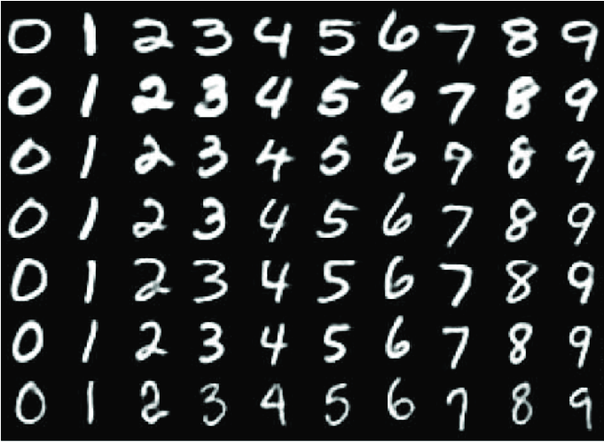

# Convolutional Neural Networks (CNN) – From Scratch (PyTorch)

Convolutional Neural Networks are widely used for image classification tasks.
In this project, I implemented CNN architectures from scratch using PyTorch and trained them on two datasets: MNIST and CIFAR-10.

The goal was not just to get accuracy, but to fully understand the neural network training pipeline — forward pass, loss calculation, backpropagation, device handling, and evaluation.

## Dataset 1 – MNIST



MNIST is a grayscale dataset of handwritten digits (0–9), containing 10 classes.
The images are simple, centered, and have almost blank backgrounds, making it a good starting point for understanding CNN fundamentals.

Using a custom CNN model, I trained the network and achieved high validation accuracy (~98%), confirming correct implementation of convolution, pooling, and fully connected layers.

## Dataset 2 – CIFAR-10


CIFAR-10 also contains 10 classes, but unlike MNIST, it consists of 32×32 RGB images with complex backgrounds and higher variability.

This dataset helped me move from simple digit classification to more realistic image classification problems.

### Architecture Used

```
Conv1: 3 → 32 (kernel=3, padding=1)

Conv2: 32 → 64 (kernel=3, padding=1)

Conv3: 64 → 128 (kernel=3, padding=1)

MaxPool (2×2) after each convolution block

Fully Connected: 2048 → 128 → 10

Loss: CrossEntropyLoss

Optimizer: Adam

Epochs: 5
```
### Results

> MNIST: ~98% validation accuracy
> CIFAR-10: 74% validation accuracy after 5 epochs

This performance represents a strong baseline model without advanced techniques like batch normalization or data augmentation.

### Debugging & Learning Moment

Initially, I mistakenly tracked only the loss from the final batch instead of averaging across all batches in an epoch. This resulted in misleadingly low loss values.

After correcting the loss aggregation, I observed realistic convergence behavior and proper learning dynamics.

This helped reinforce the importance of correct metric tracking in training loops.

### Key Takeaways

Understood the full CNN training pipeline from scratch.

Learned how spatial feature extraction differs from MLP-based models.

Improved debugging skills by identifying and fixing incorrect loss calculation.

Successfully transferred learning from MNIST (simple) to CIFAR-10 (complex).

> This project completes my foundational CNN phase and sets the stage for sequence modeling and NLP exploration.